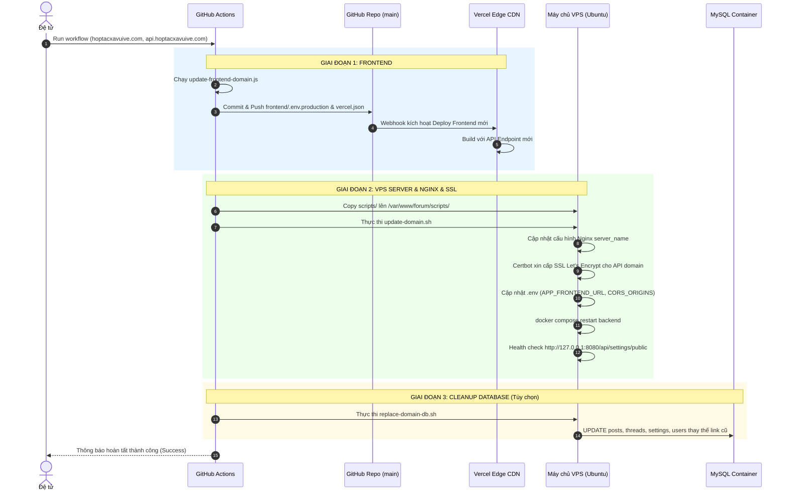

# Cẩm Nang Hướng Dẫn Đổi Tên Miền Hệ Thống Forum HTXSL (Tự Động Hóa Động 100%)

Tài liệu này hướng dẫn chi tiết quy trình chuyển đổi tên miền cho toàn bộ hệ thống Forum HTXSL (Frontend trên Vercel và Backend API trên VPS Ubuntu Docker).

Nhờ cơ chế tự động hoá qua GitHub Actions, đệ tử chỉ cần chuẩn bị các thao tác bên thứ ba (DNS Cloudflare, Vercel), sau đó kích hoạt **1-Click Workflow** để hoàn tất toàn bộ quá trình cập nhật mã nguồn, Nginx, SSL và Cơ sở dữ liệu.

---

## 1. Tổng Quan Kiến Trúc Tên Miền

Hệ thống forum gồm 2 thành phần chính:
| Thành phần | Nơi lưu trữ | Ví dụ Tên miền Mới | Chức năng |
|:---|:---|:---|:---|
| **Frontend** | Vercel Global Edge CDN | `hoptacxavuive.com` & `www.hoptacxavuive.com` | Giao diện Vue.js SPA |
| **Backend API** | VPS Ubuntu Docker | `api.hoptacxavuive.com` | Spring Boot REST API, WebSocket, File Uploads `/uploads/` |

---

## 2. Checklist Chuẩn Bị Thủ Công (Bắt Buộc)

Các bước này bắt buộc thực hiện thủ công tại các dịch vụ bên ngoài trước khi chạy Job:

### Bước 1: Cấu Hình DNS Tại Nhà Đăng Ký / Cloudflare
Vào trang quản trị Cloudflare của tên miền mới (VD: `hoptacxavuive.com`) > **DNS** > **Records**:

| Type | Name | Target / IPv4 | Proxy status | Mục đích |
|:---|:---|:---|:---|:---|
| **A** | `api` | `<IP_VPS>` (VD: `180.93.111.191`) | **DNS only** (Xám) ⚠️ | Trỏ Subdomain API về VPS. *Bắt buộc tắt proxy cam lúc đầu để Certbot cấp SSL*. |
| **CNAME** | `@` | `cname.vercel-dns.com` | **DNS only** (Xám) | Trỏ domain chính về Vercel |
| **CNAME** | `www` | `cname.vercel-dns.com` | **DNS only** (Xám) | Trỏ subdomain www về Vercel |

> [!WARNING]
> Bản ghi `A` của `api` **bắt buộc phải để DNS only (đám mây xám)** trong lần chạy đầu tiên để Certbot Let's Encrypt trên VPS có thể xác thực domain qua HTTP-01 challenge cổng 80 thành công.

---

### Bước 2: Cấu Hình Tên Miền Trên Vercel
1. Đăng nhập [vercel.com](https://vercel.com) > Chọn Project của Forum.
2. Vào **Settings** > Chọn **Domains**.
3. Nhập tên miền mới: `hoptacxavuive.com` > Bấm **Add**.
4. Chọn tuỳ chọn khuyến nghị: **Add hoptacxavuive.com and redirect www.hoptacxavuive.com to it**.
5. Chờ 1 - 2 phút đến khi hiện dấu tick xanh lá **Valid Configuration**.

---

### Bước 3: Cấp Quyền Cho GitHub Actions
Đảm bảo GitHub Actions có quyền commit cấu hình Frontend mới lên nhánh `main`:
1. Vào GitHub Repo > **Settings** (bánh răng).
2. Ở cột trái chọn **Actions** > **General**.
3. Kéo xuống mục **Workflow permissions**:
   - Chọn: **Read and write permissions**.
   - Bấm **Save**.

---

### Bước 4: Kiểm Tra DNS Đã Nhận Trước Khi Kích Hoạt Job
Mở Terminal / PowerShell trên máy tính và chạy:
```powershell
# 1. Kiểm tra API đã trỏ về IP VPS chưa:
nslookup api.hoptacxavuive.com
# Kết quả phải trả về đúng IP VPS của con

# 2. Kiểm tra Frontend đã trỏ về Vercel chưa:
nslookup hoptacxavuive.com
# Kết quả phải trả về IP của Vercel (76.76.21.123 hoặc 66.33.60.35)
```
Hoặc kiểm tra trực quan trên website: [dnschecker.org](https://dnschecker.org).

---

## 3. Thực Hiện Đổi Tên Miền (1-Click Trên GitHub Actions)

Khi các bước kiểm tra trên đã thông suốt:

1. Truy cập vào GitHub Repository của dự án.
2. Nhấn vào tab **Actions** trên cùng.
3. Ở danh sách workflow bên trái, chọn: **"Đổi tên miền hệ thống (Change System Domain)"**.
4. Nhấn nút **Run workflow** ở góc phải:
   - **Tên miền chính Frontend:** Nhập domain mới (VD: `hoptacxavuive.com`).
   - **Tên miền Backend API:** Nhập subdomain API (VD: `api.hoptacxavuive.com`).
   - **Tên miền cũ cần thay thế trong DB:** Nhập domain cũ (VD: `htxslvn.com`).
   - **Thay thế link tên miền cũ trong Database?:** Chọn `true`.
5. Bấm nút xanh **Run workflow**.

---

## 4. Quy Trình Tự Động Diễn Ra Bên Trong Job

GitHub Actions sẽ tự động thực hiện tuần tự:



---

## 5. Danh Sách Kiểm Tra Sau Khi Đổi Tên Miền Thành Công

Sau khi GitHub Actions báo xanh lá (Success):

- [ ] Truy cập `https://api.hoptacxavuive.com/api/settings/public` trên trình duyệt:
  - Có ổ khóa bảo mật màu xanh (SSL Let's Encrypt).
  - Trả về dữ liệu JSON cấu hình diễn đàn không báo lỗi.
- [ ] Truy cập `https://hoptacxavuive.com`:
  - Diễn đàn tải nhanh, favicon và giao diện hiển thị đúng.
  - Mở DevTools (F12) > Tab Network: Các request API đều gọi về `https://api.hoptacxavuive.com/api/...` với mã HTTP 200.
  - Tab Console: Không có lỗi CORS hoặc lỗi kết nối WebSocket.
- [ ] Thử đăng nhập tài khoản và tạo một bài viết mới có đính kèm ảnh:
  - Ảnh upload thành công và hiển thị rõ ràng.
- [ ] **Cloudflare Turnstile:**
  - Vào Cloudflare Dashboard > Turnstile > chọn Widget > Settings: Thêm domain mới (ví dụ `hoptacxavuive.com`) vào mục **Hostnames**.
- [ ] **Resend Email:**
  - Vào Resend Dashboard > Domains: Thêm domain mới và cấu hình các bản ghi DNS (SPF, DKIM, MX) trên Cloudflare DNS để đạt trạng thái "Verified".
- [ ] **Kiểm tra chức năng liên quan:**
  - Thử tính năng "Quên mật khẩu": Đảm bảo mã OTP được gửi về hòm thư qua Resend thành công.
  - Thử tính năng "Đăng ký tài khoản": Đảm bảo widget Turnstile chống Bot hoạt động trơn tru và tài khoản được tạo thành công.
